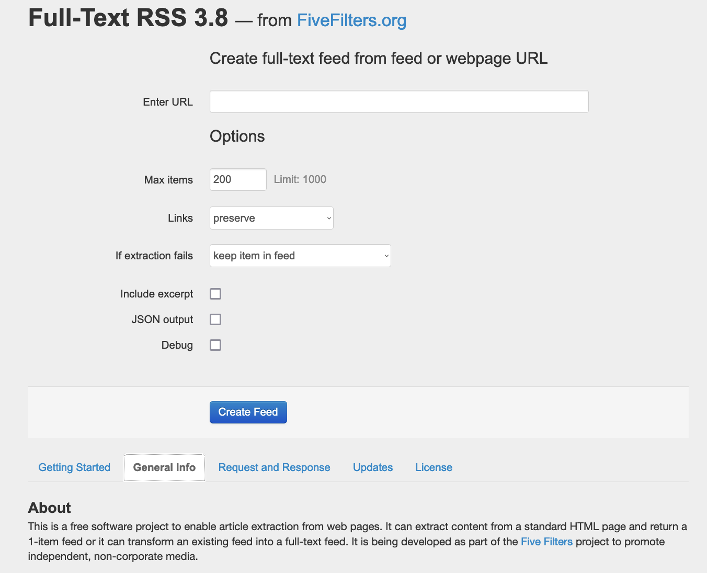

# Docker Image for fivefilters Full-Text RSS service


This is containerized version of [fivefilters full-text-rss](https://www.fivefilters.org/full-text-rss/), which retrieves the full-text of individual articles or complete full-text RSS feeds.

Not affiliated with [fivefilters.org](http://fivefilters.org/).

The Dockerfile is licensed under [MIT conditions](LICENSE).


## User Guide

- Use the following [docker-compose.yml](docker-compose.yml) 

```yaml
services:
  fullfeedrss:
    image: "heussd/fivefilters-full-text-rss:latest"
    environment:
      # Leave empty to disable admin section
      - FTR_ADMIN_PASSWORD=
    volumes:
      - "rss-cache:/var/www/html/cache"
    ports:
      - "80:80"
volumes:
  rss-cache:
```

- Start it with `docker-compose up`
- Visit [http://localhost:80](http://localhost:80) for the integrated web UI



- Interesting endpoints (see tab [Request & Response](http://localhost/#request)):
	- Article extraction: `http://localhost/extract.php?url=[url]`
	- Feed conversion: `http://localhost/makefulltextfeed.php?url=[url]`
